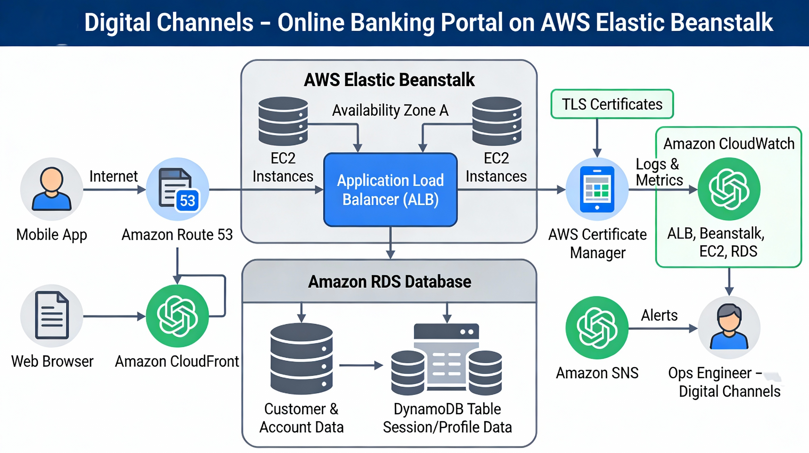

# Digital Channels – Online Banking Portal on AWS Elastic Beanstalk

This project simulates an online banking digital channel (web portal) running on AWS Elastic Beanstalk, with a focus on how an operations / SRE engineer would monitor, release, and run it in production.  
It is designed to be deployable within or close to the AWS Free Tier by using small instance types and low traffic.

---

## Architecture

The architecture is a simplified online banking portal hosted on AWS:

- **Client:** Web browser (and optionally mobile web) accessing a secure HTTPS endpoint.
- **Edge & routing:**  
  - Amazon Route 53 for DNS.  
  - (Optional) Amazon CloudFront as CDN in front of the Application Load Balancer.  
- **Application layer:**  
  - AWS Elastic Beanstalk environment (multi‑AZ) running a small web application (e.g., Node.js / Java / Python).  
  - Auto Scaling across at least two Availability Zones.  
- **Data layer:**  
  - Amazon RDS (Multi‑AZ) for core customer/account data.  
  - (Optional) Amazon DynamoDB for session or profile data.  
- **Security & reliability services:**  
  - AWS Certificate Manager (ACM) for TLS certificates.  
  - IAM roles for least‑privilege access between app and databases.  
- **Observability & alerts:**  
  - Amazon CloudWatch for metrics, logs, and dashboards.  
  - Amazon SNS for alert notifications to on‑call engineers.

The architecture diagram is provided as:

---

## Features

- Sample online banking flows (can be minimal / mock data):
  - Login and logout.
  - Dashboard / account summary.
  - Transaction list.
- Deployed using AWS Elastic Beanstalk with:
  - Application Load Balancer.
  - Auto Scaling.
  - Encrypted database connection.
- Production‑style operations:
  - Operational KPIs and SLO‑like targets.
  - CloudWatch dashboards and alarms.
  - Runbooks for login outages and blue/green releases.

---

## Operational KPIs

These KPIs are used as targets to simulate how a real bank would operate its digital channels:

| KPI                           | Target / Description                                                                |
|-------------------------------|-------------------------------------------------------------------------------------|
| Portal availability           | ≥ 99.5% monthly, based on ALB and environment health metrics                       |
| Login p95 latency             | < 300–500 ms under normal demo load for `/login`                                   |
| Account summary p95 latency   | < 500 ms for key read APIs (e.g., `/accounts`, `/transactions`)                    |
| HTTP 5xx error rate           | < 0.5–1% over rolling 5‑minute windows for customer‑facing endpoints               |
| CPU utilization               | Average < 60% on application instances to maintain headroom                        |
| DB saturation                 | DB connections and I/O within safe thresholds, no sustained throttling or errors  |

You can adjust the thresholds based on your own testing and environment size.

---

## Monitoring & Dashboards

Monitoring is centered around Amazon CloudWatch, with alarms routed through SNS.

### Metrics and logs

Key metrics:

- **Application Load Balancer**
  - `RequestCount`
  - `TargetResponseTime`
  - `HTTPCode_Target_4XX_Count`
  - `HTTPCode_Target_5XX_Count`
- **Elastic Beanstalk / EC2**
  - CPU utilization
  - (Optional) memory and disk via CloudWatch agent
  - Environment health status
- **RDS / DynamoDB**
  - CPU utilization
  - Database connections
  - Throttled requests / IOPS (for DynamoDB)
  - Free storage space (for RDS)
- **Application logs**
  - Structured logs in CloudWatch Logs with:
    - Request path and method
    - Correlation ID / request ID
    - User ID (masked/anonymized if needed)
    - Error messages and stack traces

### CloudWatch dashboards

Recommended dashboards (examples):

- **“DigitalChannels-Health”**
  - ALB request count, latency (p95), 4xx/5xx by endpoint group (e.g., login, dashboard).
  - Environment health for the Beanstalk environment.
  - High‑level availability widget (OK vs Alarm count).

- **“DigitalChannels-Backend”**
  - RDS CPU, connections, read/write IOPS, free storage.
  - DynamoDB capacity and throttles (if used).
  - EC2/Beanstalk CPU, Auto Scaling group desired/actual instances.

### Alarms

Examples of alarms (tune thresholds for your environment):

- `ALB-5XX-High` – 5xx error rate > 1% for 5 minutes.
- `Login-Latency-High` – p95 `TargetResponseTime` for `/login` > 2s for 5 minutes.
- `EB-Env-Health-Degraded` – environment health not **Green** for > 5 minutes.
- `RDS-CPU-High` – CPU > 80% for 10 minutes.
- `RDS-Connections-High` – connections near configured limit for sustained periods.

All alarms should publish notifications to an SNS topic subscribed by the on‑call engineer (email/Slack/Teams integration).

---

## Runbooks (Operations Playbooks)

This repository includes production‑style runbooks to demonstrate how incidents and changes are handled.

- [`docs/runbook-login-outage.md`](docs/runbook-login-outage.md)  
  Step‑by‑step procedure to detect, triage, mitigate, and review login outages or severe login degradation, including:
  - Which CloudWatch metrics and logs to inspect.
  - How to roll back recent changes or restart unhealthy components.
  - Communication and post‑incident review steps.

- [`docs/runbook-release-blue-green.md`](docs/runbook-release-blue-green.md)  
  Blue/green release process for the portal on Elastic Beanstalk, covering:
  - Preparing and validating a green environment.
  - DNS / CNAME swap from blue to green.
  - Observation window and rollback to blue if needed.
  - Change documentation and lessons learned.

These runbooks are written to mirror how a banking digital‑channels operations team would standardize procedures for high‑impact user journeys like login and releases.

---

## How this maps to Banking Digital Channels Operations

Banks refer to “digital channels” as the ways customers interact with the bank digitally: online banking, mobile apps, digital wallets, ATMs, contact centers, and APIs.  
This project focuses on the **online portal** part of that landscape and models how it would be run on AWS from an operations point of view.

In particular:

- The application simulates a simplified **online banking portal** where customers log in, view balances, and see transactions, similar to a real bank’s web and mobile front ends.
- The **Operational KPIs** (availability, latency, error rate, saturation) mirror what digital‑channels ops teams care about for critical journeys like login and account overview.
- The **monitoring and dashboards** show how to use CloudWatch metrics and logs to get real‑time visibility into channel health.
- The **runbooks** demonstrate production‑style procedures for:
  - Handling a login outage (one of the highest‑impact issues in digital channels).
  - Safely rolling out new versions via blue/green deployment and rolling back if necessary.

